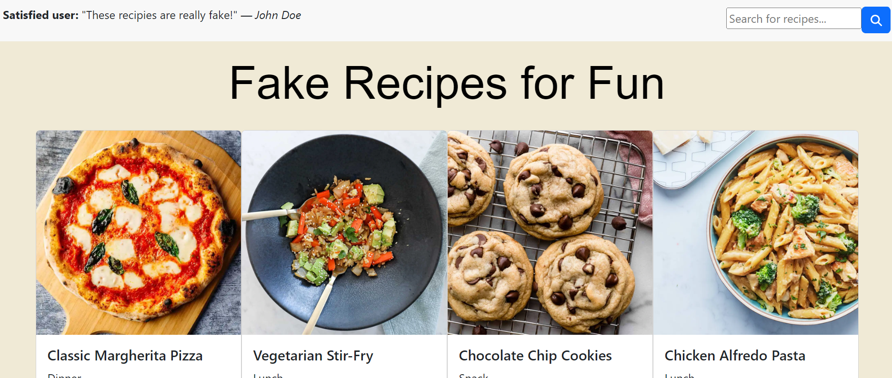

# Fake Recipe App

The Fake Recipe App is a simple web application that allows users to browse, search, and view details of various recipes. This project is built using React, Bootstrap and the dummyJSON API. It demonstrates basic functionalities such as displaying a list of items, searching, and navigating between different pages.



## Table of Contents

- [Installation](#installation)
- [Usage](#usage)
- [Pages](#pages)
- [Components](#components)
- [Functionality](#functionality)
- [Contributing](#contributing)
- [License](#license)

## Installation

1. Clone the repository:
   ```sh
   git clone https://github.com/nmiller2379/fake-recipe-app.git
   ```
2. Navigate to the project directory:
   ```sh
   cd fake-recipe-app
   ```
3. Install the dependencies:
   ```sh
    npm install
   ```

## Usage

1. Start the development server:
   ```sh
   npm start
   ```
2. Open [http://localhost:3000](http://localhost:3000) to view it in the browser.

## Pages

### Home Page

The Home Page displays a list of recipes. Each recipe is represented by a Recipe Card component that shows the recipe name, image, and a short description. Users can click on a recipe card to view its details.

### Recipe Details Page

The Recipe Details Page shows detailed information about a selected recipe. It displays the recipe name, image, ingredients, and instructions. Users can navigate back to the Home Page by clicking the back button.

### Search Results Page

The Search Results Page displays a list of recipes that match the search query. Users can click on a recipe card to view its details.

## Components

### Header

The Header component is a navigation bar that contains links to the Home Page and Search Results Page. It also includes a Search Bar component for users to search for recipes.

### Recipe Card

The Recipe Card component displays an individual recipe. It shows the recipe name, image, and a short description. Users can click on the card to view the Recipe Details Page.

### Search Bar

The Search Bar component allows users to search for recipes by name or ingredient. Users can enter a search query and click the search button to display the search results.

## Functionality

- Display a list of recipes on the Home Page.
- Click on a recipe card to view its details on the Recipe Details Page.
- Search for recipes by name or ingredient using the Search Bar.

## Contributing

Contributions are welcome! Please feel free to submit a pull request if you would like to add new features, fix bugs, or improve the project.

## License

This project is licensed under the MIT License - see the [LICENSE](LICENSE) file for details.
